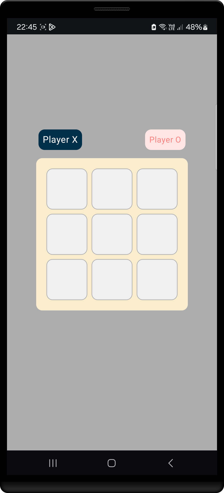
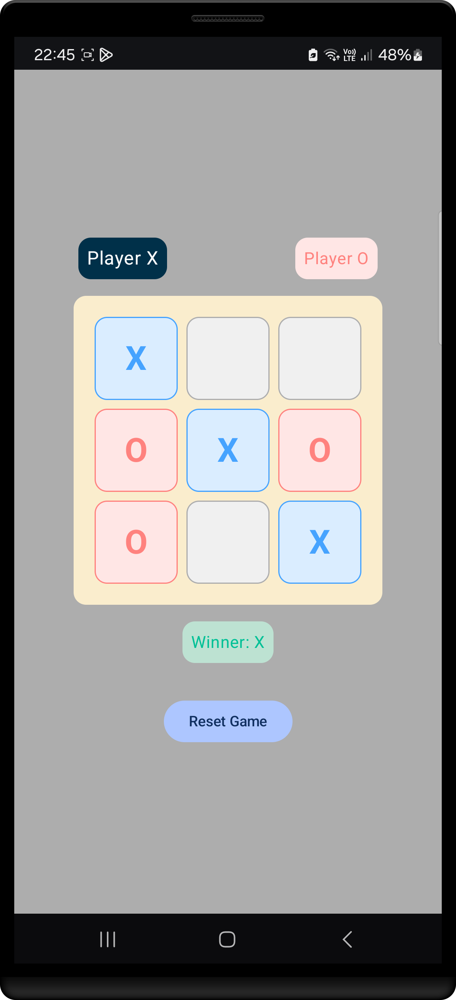
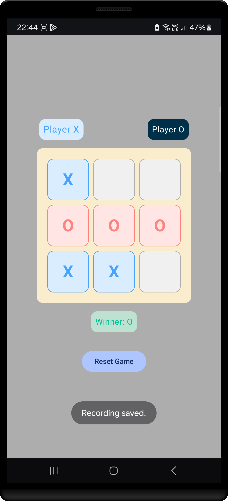

# Tic-Tac-Toe in Jetpack Compose

A simple and interactive Tic-Tac-Toe game built using Jetpack Compose for Android. This project showcases how to use Jetpack Compose to build a responsive and modern Android UI with minimal code. The game allows two players to play on the same device, offering a fun way to demonstrate state management and UI building in Jetpack Compose.

## Features
- **Two-player mode**: Play Tic-Tac-Toe with a friend on the same device.
- **Interactive UI**: Players tap on the grid to place their mark (X or O).
- **Game Status**: The app displays the current player's turn and the winner once the game is over.
- **Responsive Design**: The UI adapts to different screen sizes and orientations.
- **Clean Architecture**: The game follows a simple architecture pattern with clear separation between UI and logic.

## Tech Stack
- **Jetpack Compose**: Declarative UI framework for building modern Android apps.
- **Kotlin**: The primary programming language used.
- **State Management**: Utilize Compose’s state management (e.g., `remember`, `mutableStateOf`) to handle the game state.
- **Material Design**: Use of Material Design components to enhance the UI and provide a consistent design.

## Installation

To get started with this project, follow these steps:

1. **Clone the repository:**
   ```bash
   git clone https://github.com/YoussefmSaber/PRODIGY_AD_04
   ```

2. **Open the project in Android Studio:**
   - Open Android Studio and click on "Open an existing project".
   - Navigate to the folder where you cloned the project and select it.

3. **Run the project:**
   - Connect an Android device or use an emulator.
   - Click on the "Run" button in Android Studio to build and run the app.

## Usage

- Once the app is running, you can play Tic-Tac-Toe with another player on the same device.
- The app will alternate turns between the players (X and O).
- The game will notify you of a winner or if there’s a draw.
- You can restart the game by tapping on the grid after the game ends.

## Screenshots

| Start Screen                                                    | X player win                                                       | O player win                                                       |
|-----------------------------------------------------------------|--------------------------------------------------------------------|--------------------------------------------------------------------|
|  |  |  |

---

## Contributing

Feel free to contribute to this project! Here’s how you can help:

- **Bug Reports**: If you find a bug or issue, please report it by opening an issue in this repository.
- **Feature Requests**: Suggest new features that you would like to see in the app.
- **Pull Requests**: If you want to contribute code, fork the repository, create a new branch, make your changes, and submit a pull request.

## License

This project is licensed under the MIT License - see the [LICENSE](LICENSE) file for details.

---

Enjoy playing Tic-Tac-Toe and exploring Jetpack Compose!
